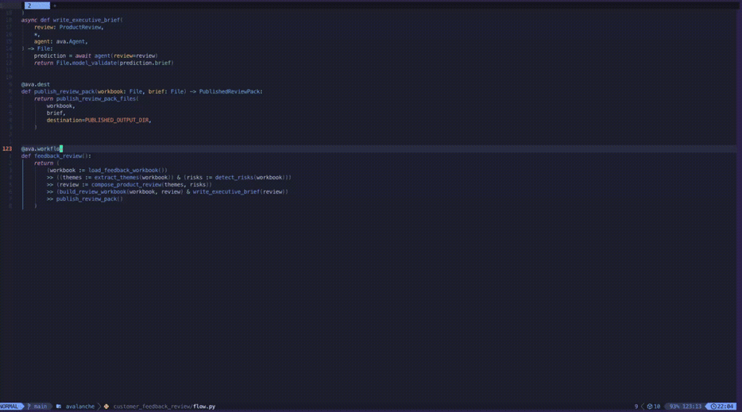

<p align="center">
  
</p>

# Avalanche

Avalanche makes agents first-class steps in typed data pipelines. Compose adaptive agent work with deterministic Python transformations in one DAG, run it through the Avalanche operator, and inspect every run from the web UI.

<br>
<p align="center">
  <a href="https://github.com/Trampoline-AI/avalanche/actions/workflows/ci.yml"></a>
  <a href="https://pypi.org/project/avalanche-ai/"></a>
  <a href="https://pypi.org/project/avalanche-ai/"></a>
  <a href="https://discord.gg/BAkd288sGN"></a>
  <a href="https://github.com/Trampoline-AI/avalanche"></a>
  <br/>
  crafted with ♥ in MTL · NYC · FLP<br/>by <a href="https://trampoline.ai">Trampoline AI</a>
</p>

<p align="center">
  
</p>

> [!NOTE]
> Avalanche is an early release candidate intended for local development and experimentation. APIs and operational behavior may change before a stable release.

## Requirements

- Python 3.11, 3.12, or 3.13.
- A LLM provider API key or Codex subscription for agent steps.
- uv (recommended, https://docs.astral.sh/uv/)

## Quickstart

Move into an empty directory, then run this command to initialize a starter
project with the Avalanche skill installed and an example workflow:

```bash
uvx avalanche-ai@latest init
```

Follow the instructions to set up your LLM provider. Then finally, run the demo:

```bash
uv run ava dev
```

This starts the operator and opens the browser UI at `http://127.0.0.1:7435`.

You can then use the provided avalanche skill to create your own workflow by describing your wanted outcome to your agent:

```bash
/avalanche <outcome>
```

## Installation

### Option A — Starter project (recommended)

Create an empty directory, move into it, and run:

```bash
uvx avalanche-ai@latest init
```

Follow the instructions to set up your LLM provider.

This installs a ready-to-run starter project with project dependencies, the Avalanche
authoring skill, provider setup, and an example workflow. Its key structure is:

```text
.
├── .agent/
│   └── skills/
│       └── avalanche/                # Avalanche workflow creation skill
├── scripts/
│   └── configure-provider.sh         # LLM provider setup
├── src/                              # workflows live here
│   └── binary_converter/
│       └── flow.py                   # included example workflow
├── AGENTS.md                       
├── pyproject.toml                  
└── uv.lock
```

When run from an interactive terminal, the bootstrapper offers provider setup immediately. To change
providers or credentials later in the starter project:

```bash
bash scripts/configure-provider.sh
```

#### Local checkout dependencies

To develop Avalanche and PredictRLM alongside a new workspace, initialize an
empty directory with editable dependencies:

```bash
uvx avalanche-ai@latest init --editable-deps
```

This clones both Trampoline AI projects into `.trampoline-ai/` and configures
them as local editable dependencies, so changes to either checkout are used
immediately by the workspace.

### Option B — Existing project

Avalanche is also usable as a project dependency.

Add Avalanche to an existing project:

```bash
uv add avalanche-ai
```

Install the avalanche skill in the same project:

```bash
npx skills add Trampoline-AI/avalanche
```

## Usage

### Creating a workflow

Avalanche workflows chain deterministic `@ava.step`, agent-backed
`@ava.agent_step`, and TypeSafe-backed `@ava.classifier_step` nodes inside an
`@ava.workflow`.

```python
@ava.step
def step1() -> str:
    return "Hello world"
```

```python
@ava.agent_step(ava.Signature("text: str -> completion: str"))
async def step2(text: str, *, agent: ava.Agent) -> str:
    return (await agent(text=text)).completion
```

```python
@ava.workflow
def feedback_workflow():
    return step1() >> step2()
```

Use [agent steps](docs/agent-steps.md) for adaptive model work and
[classifier steps](docs/classifier-steps.md) for fixed Choice, Noul, and Score
questions with typed probabilities. Both keep input preparation, output
composition, and persistence in the Python step body.

We recommend using the skill directly in order to have your agent align on a goal and build a workflow for you.

Open your coding agent in the same project where you installed avalanche, then:

```
/avalanche <Describe your wanted outcome here>
```

for codex:

```
$avalanche <Describe your wanted outcome here>
```

### Running the operator and Web UI

In a workspace configured with `[tool.avalanche].flow_targets`, the operator
scans that code for workflows, then loads and runs them:

```bash
uv run ava operator
```

This also serves the Web UI and development REST API at
`http://127.0.0.1:7435`. Open that address in your browser, or use `ava dev`
to open it automatically:

```bash
uv run ava dev
```

`ava init` writes this workspace configuration, so the starter command scans
every Python workflow below `src/`:

```toml
[tool.avalanche]
flow_targets = ["src"]
```

`operator` and `dev` use `flow_targets` when positional `FLOW` values are
omitted. Configuration paths are relative to that `pyproject.toml`. Passing one
or more `FLOW` values replaces the configuration rather than adding to it:

```bash
uv run ava operator ./flows ./shared_flows --port 7433
```

Without explicit targets or a nonempty `flow_targets` setting, the command
stops before starting services. It never scans the current directory by default.

Discovery allows 60 seconds per scan by default. Pass `--discovery-timeout SECONDS`
to `ava operator` or `ava dev` to set a different positive, finite limit.

> [!WARNING]
> Discovery imports eligible Python modules beneath each target. Use a specific
> flow file or dedicated flow directory, not a mixed repository root.

For a separate HTTP listener, start the operator with `--no-web`, then connect:

```bash
uv run ava web --connect localhost:7433
```

The operator defaults to `127.0.0.1:7433` and the Web UI/REST listener to
`http://127.0.0.1:7435`. Use `--web-port` with `ava operator` or `ava dev`
to change the HTTP port; `ava web` uses `--port` instead.

### Development REST API

The built-in API is available under `/api/v1` on the same listener as the Web UI.
It translates JSON requests into the existing operator gRPC calls; it does not
add a deployment service, separate run store, or durable recovery.
`ava operator` and `ava dev` bind HTTP to loopback. There is no built-in
authentication; do not expose it to an untrusted network. A separately launched
`ava web --host ... --trusted-proxy` requires an external authenticated boundary.

| Method | Path (under `/api/v1`) | Response |
| --- | --- | --- |
| GET | `/flows` | Discovered flows and their `workflow_selector` values |
| POST | `/runs` | `202` with `run_id`; execution continues asynchronously |
| GET | `/runs` | Paginated run summaries |
| GET | `/runs/{run_id}` | Snapshot with `summary`, node states, and topology |
| POST | `/runs/{run_id}/cancel` | `200` acknowledging cancellation; poll for terminal state |
| GET | `/runs/{run_id}/output` | Retained result value and file descriptors |
| GET | `/runs/{run_id}/activity` | Paginated log or node-event descriptors |

For example, with the operator running:

```bash
curl http://127.0.0.1:7435/api/v1/flows

# Copy workflow_selector from discovery; supply your workflow's input fields.
curl -X POST http://127.0.0.1:7435/api/v1/runs \
  -H 'Content-Type: application/json' \
  -d '{"workflow_selector":"flows.py::my_flow","input_json":{"value":41}}'

# Use the run_id returned above.
curl http://127.0.0.1:7435/api/v1/runs/RUN_ID
curl http://127.0.0.1:7435/api/v1/runs/RUN_ID/output
curl -X POST http://127.0.0.1:7435/api/v1/runs/RUN_ID/cancel \
  -H 'Content-Type: application/json'
```

Create requests require a nonempty `workflow_selector`. Optional `input_json`
and `context_json` are JSON objects, not JSON-encoded strings, and default to `{}`.
Omitting `run_id` generates a new ID; a supplied ID must satisfy the operator's
run-ID rules. Reusing an existing ID returns `409`; it does not start another run
or replay an earlier response. Unknown fields are rejected. File uploads and
Delta's deployment/rerun fields are not part of this API; use the existing
CLI/gRPC file-input support when needed.

List endpoints accept `page_size` (positive integer, default 100; the operator
caps pages at 500) and `continuation`. To continue, JSON-encode the complete
`next_page` object from the response and URL-encode it as `continuation`; omit
it on the first request. Preserve the same filters throughout the page chain.
`GET /runs` also accepts `workflow_selector`. Activity accepts `node_id` for
agent/classifier events and `order=forward|newest_first`; without `node_id` it
lists run-wide log descriptors.

Responses preserve the existing protobuf JSON contract with snake_case names.
64-bit integers are JSON strings. `/output` exposes Avalanche's encoded result
document in `value.value_json`, with its digest and size alongside it; this is
not a plain workflow-result object. File bodies and activity-detail bodies
remain available through gRPC and the existing CLI/UI, not these REST routes.

Errors are JSON: `{"error":{"code":"NOT_FOUND","message":"..."}}`.
Invalid JSON or query parameters return `400`, unknown resources `404`,
unsupported methods `405`, and duplicate runs or unavailable results `409`.
Create and cancellation requests require `application/json` (`415` otherwise).
This rejects ordinary browser form submissions; cross-origin JSON requests need
a CORS preflight, which the local listener does not authorize. Cancellation needs
no body. Create requests also require `Content-Length` (`411` otherwise), with a
4 MiB body limit (`413`).
An unavailable operator returns `503`; an upstream call exceeding 30 seconds
returns `504`. A timeout does not prove a run was not started: if you supplied
a run ID, inspect that run before submitting another request.

### Embedding the operator UI

`@trampoline-ai/operator-ui` is the embeddable React package for an Avalanche operator
interface. It exports `OperatorUi`, `WorkflowWorkspace`, `GrpcWebOperatorApi`, and their
typed host APIs. The embedding host owns its `OperatorApi` implementation and presentation
configuration.

After a version is released, configure the GitHub Packages scope and an authenticated token
outside source control:

```ini
@trampoline-ai:registry=https://npm.pkg.github.com
//npm.pkg.github.com/:_authToken=${NODE_AUTH_TOKEN}
```

Then install that version and its styles:

```bash
pnpm add @trampoline-ai/operator-ui@<version>
```

```tsx
import "@trampoline-ai/operator-ui/styles.css";
import { OperatorUi } from "@trampoline-ai/operator-ui";
```

Avalanche does not provide a remote operator endpoint or authentication boundary for an
embedding host.

### Releasing Avalanche and the operator UI

The Python distribution and `@trampoline-ai/operator-ui` share one version and one
Avalanche `vX.Y.Z` release tag. There are no separate operator UI releases, even when
only the backend changes. Use the UI version matching your Avalanche operator.

1. Update `pyproject.toml`, `src/avalanche/__init__.py`, and `web/operator/package.json`
   together, and run `uv lock`. Stable versions are identical; prereleases use Python
   spelling such as `0.4.0rc1` and npm spelling `0.4.0-rc1` (likewise Python `a`/`b`
   map to npm `alpha`/`beta`).
2. Move the unreleased changelog entries under the new version.
3. Run `make web-test`, `make web-lint`, `make web-assets-check`, and `uv build`.
   From `web/operator`, run `pnpm pack` to check the npm archive.
4. Merge the release commit to `main`, then create and push the matching Avalanche
   tag, such as `v0.4.0` or `v0.4.0-rc1`. Prereleases must have patch version zero.

The `Release` workflow checks both versions, generated clients, browser tests and
assets, and the npm archive before publishing either package. It publishes Python
distributions to PyPI and the UI to GitHub Packages (`latest` for stable versions,
`next` for prereleases). The GitHub Release appears only after both publishes succeed.

The two registries cannot publish atomically. If one publish fails, rerun the failed
jobs in the same workflow run to reuse its validated artifacts; do not move the tag
or bump just one package. PyPI skips files already uploaded. The npm publisher skips
an existing version only when its archive integrity matches, and fails on conflicting
contents or registry errors. Re-running an already published UI does not move its npm
distribution tag, so retrying an older release does not change `latest` or `next`.

### Running a workflow

Once you have the operator running, you can either start workflows directly in the web UI, or start runs from your command line in a different terminal:

```bash
uv run ava run <workflow_name>
```

### TUI

Avalanche also ships with a Terminal UI, that you can launch on the operator:

```bash
uv run ava tui --connect localhost:7433
```

The operator defaults to port 7433.

### Workflow inputs

Avalanche supports passing inputs to workflows using the BaseInput class. Learn more in
[the DAG API&#39;s input and context guide](docs/dag-api.md#input-and-context). You can pass
inputs directly in the Web UI using small JSON editor, or through the command line:

```bash
uv run ava run <workflow_name> --input '{"key": "value"}'
```

### Embedded workflows

You can run a workflow directly from Python. `.run()` returns an awaitable `RunHandle`; call `.result()` to wait synchronously:

```python
run = feedback_workflow().run(executor=ava.LocalExecutor())
print(run.run_id)
result = run.result()
```

## Quick Example

```python
import random
import avalanche as ava

@ava.source
def generate_binary() -> str:
    length = random.randint(128, 256)
    return "1" + "".join(random.choice("01") for _ in range(length - 1))

@ava.agent_step(
    ava.Signature(
        "binary: str -> decimal: str",
    ),
    lm="openai/gpt-5.6-terra",
)
async def convert_binary(binary: str, *, agent: ava.Agent) -> str:
    return (await agent(binary=binary)).decimal

@ava.dest
def print_result(result: str) -> str:
    print(result)
    return result


@ava.workflow
def binary_converter():
    return generate_binary() >> convert_binary() >> print_result()
```

## Examples

The [`examples/`](examples/) directory contains runnable workflows. Start with
the customer feedback review, a production-shaped agentic data-transformation
workflow; the rest are focused pattern demos.

| Example                                                            | Description                                                                                                                                             |
| ------------------------------------------------------------------ | ------------------------------------------------------------------------------------------------------------------------------------------------------- |
| [Customer feedback review](examples/customer_feedback_review/)      | End-to-end agentic workflow: parallel theme/risk analysis of a feedback workbook, deterministic reconciliation, and published Excel + Word review pack. |
| [`classifier_workflow.py`](examples/classifier_workflow.py) | TypeSafe Choice, Noul, and Score questions, typed answers, and current/historical classifier inspection in the operator UI. |
| [`complex_dag_pattern.py`](examples/complex_dag_pattern.py)       | Local DAG API with explicit data passing, fan-out, and fan-in on`ava.LocalExecutor`.                                                                  |
| [`stream_pattern.py`](examples/stream_pattern.py)                 | Stream-based incremental processing with local Iceberg tables.                                                                                          |
| [`cursor_pattern.py`](examples/cursor_pattern.py)                 | Manual checkpoint control with cursors for advanced incremental flows.                                                                                  |
| [`document_file_workflow.py`](examples/document_file_workflow.py) | Typed`ava.File` inputs and outputs through a `BaseInput` workflow.                                                                                  |
| [`operator_workflow.py`](examples/operator_workflow.py)           | Flow file for the local operator and connected TUI path.                                                                                                |

See [`examples/README.md`](examples/README.md) for how to run each example.

## LLM providers and models

Avalanche sends agent-model requests through [LiteLLM](https://www.litellm.ai/).
Any provider and model supported by LiteLLM is therefore supported by Avalanche.
Configure the provider credentials as environment variables documented in
[LiteLLM&#39;s provider guide](https://docs.litellm.ai/docs/providers); the process
running the operator must have access to those variables.

We select models on each `@ava.agent_step` with LiteLLM's provider-qualified
model identifier. `lm` selects the main model and `sub_lm` selects the
sub-model:

```python
@ava.agent_step(
    ExtractThemes,
    lm="openai/gpt-5.6-terra",
    sub_lm="gemini/gemini-3.5-flash",
)
async def extract_themes(..., *, agent: ava.Agent) -> ThemeReport:
    ...
```

When a workflow's agent steps share models, we set them once with
`@ava.workflow(agent_defaults=...)`:

```python
@ava.workflow(
    agent_defaults={
        "lm": "openai/gpt-5.6-terra",
        "sub_lm": "gemini/gemini-3.5-flash",
    }
)
def feedback_workflow():
    return extract_themes()
```

An `lm` or `sub_lm` passed to an individual agent step overrides the same
workflow default. `agent_defaults` configures runtime options only; signatures, skills, and
tools remain defined on each agent step.

Classifier steps use TypeSafe directly, not LiteLLM. Set `TYPESAFE_API_KEY` in the
executing environment or your project's `.env` file; exported variables take precedence.
Choose `model` and `timeout` on `@ava.classifier_step` or in
`@ava.workflow(classifier_defaults={...})`. Step values override workflow values;
otherwise the defaults are `jev-latest` and 10 seconds. No key is needed to
discover questions before running. Declare optional defaults with
`@ava.classifier_step(questions=...)`, or supply a complete runtime mapping with
`await classifier(state=..., questions=...)`; call questions replace, not merge
with, defaults. See [Classifier steps](docs/classifier-steps.md) for the full API,
probability semantics, and local evidence retention limits.

## Optional components

| Extra     | Purpose                       |
| --------- | ----------------------------- |
| `ray`   | Ray-backed workflow execution |
| `lance` | Lance storage backend         |

The remaining extras can be combined:

```bash
uv add "avalanche-ai[ray,lance]"
```

## Documentation

- [DAG API](docs/dag-api.md)
- [Agent steps](docs/agent-steps.md)
- [Classifier steps](docs/classifier-steps.md)
- [Data model and storage API](docs/data-model-api.md)
- [Execution services](docs/execution-services.md)
- [Architecture](ARCHITECTURE.md)
- [Examples](examples/README.md)
- [Changelog](CHANGELOG.md)

## Contributing

Contributions are welcome. See [CONTRIBUTING.md](CONTRIBUTING.md) for local setup,
quality gates, and pull request expectations.

## License

Avalanche is licensed under the [MIT License](LICENSE).
