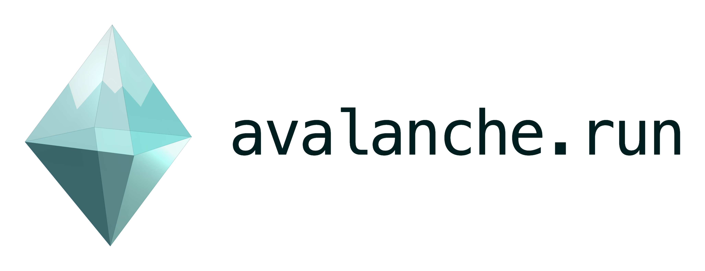

<p align="center">
  
</p>


# Avalanche

Avalanche makes agents first-class steps in typed data pipelines. Compose  
adaptive agent work with deterministic Python transformations in one DAG, run  
it through the Avalanche operator, and inspect every run from the terminal UI.

> [!NOTE]  
> Avalanche is an early release candidate intended for local development and  
> experimentation. APIs and operational behavior may change before a stable  
> release.

## Installation

Add avalanche to your project:

```bash
uv add avalanche --all-extras
```

## Requirements

- Python 3.11, 3.12, or 3.13.
- Agent steps require the `agent` extra and credentials for the model provider
configured through PredictRLM/DSPy.
- The operator and connected TUI require the `runtime` and `tui` extras.
- Ray and Lance support are optional and require their corresponding extras.


## Quickstart


### With your coding agent

Give your coding agent Avalanche's workflow-authoring skill:

```bash
npx skills add Trampoline-AI/avalanche
```

### Workshop project setup

Create and enter an empty directory, then bootstrap the workshop project:

```bash
curl -fsSL https://raw.githubusercontent.com/Trampoline-AI/avalanche/main/init.sh | bash
```

The bootstrapper is non-interactive. Configure the starter flow's provider from
an interactive terminal after it completes:

```bash
bash scripts/configure-provider.sh
```

Then finally, run the demo:

```bash
uv run ava operator --flows src/binary_converter/ --web
```

Avalanche comes with a built-in web ui that you can access once the operator has launched at http://127.0.0.1:7435 on your machine.


### Quick Example

```python
import random
import avalanche as ava

@ava.source
def generate_binary() -> str:
    length = random.randint(128, 256)
    return "1" + "".join(random.choice("01") for _ in range(length - 1))

@ava.agent_step(
    ava.Signature(
        "binary: str -> decimal: str",
    ),
    lm="openai/gpt-5.6-terra",
)
async def convert_binary(binary: str, *, agent: ava.Agent) -> str:
    return (await agent(binary=binary)).decimal

@ava.dest
def print_result(result: str) -> str:
    print(result)
    return result


@ava.workflow
def binary_converter():
    return generate_binary() >> convert_binary() >> print_result()
```

The handle is process-local and its non-daemon driver thread keeps the embedded
process alive until the run finishes. `run.cancel()` requests cooperative
cancellation between node submissions; it does not forcibly stop an active
thread or Ray task. Durable run state remains an operator responsibility.
Terminal values may contain `ava.File` or `ava.Workspace` directly or nested in
supported Pydantic/list/tuple/dict results. Embedded `.result()` returns the
original Python shape and portable file/workspace objects. A terminal
`Workspace` carries its serializable manifest; its local `.path` exists only
while Avalanche is executing user node code.

Start with the simplest smoke-tested example:
Run it through the local operator:

```bash
uv run ava dev --flows path/to/flow
```


## Real example agentic data transformation workflow

This example is closer to what a real production avalanche workflow can look like. This workflow turns product feedback into prioritized work in a CRM. It loads a typed corpus, runs theme and risk analysis in parallel, synthesizes both reports, and pushes the resulting plan to an external system.

Set the credential required by your model provider. For the model in this
example:

```bash
OPENAI_API_KEY="..."
ANTHROPIC_API_KEY="..."
GEMINI_API_KEY="..."
```

Define your steps:

```python
class Feedback(BaseModel):
    area: str
    message: str


class FeedbackCorpus(BaseModel):
    records: list[Feedback]


@ava.source
def load_corpus() -> FeedbackCorpus:
    return warehouse.load_feedback()
```

```python
class Theme(BaseModel):
    name: str
    evidence: list[str]


class ThemeReport(BaseModel):
    themes: list[Theme]


class ExtractThemes(ava.Signature):
    """Find recurring product needs and cite the feedback behind each one."""

    corpus: FeedbackCorpus = ava.InputField(
        desc="The complete product-feedback corpus to analyze."
    )
    report: ThemeReport = ava.OutputField(
        desc="Recurring themes with the supporting feedback."
    )


@ava.agent_step(ExtractThemes, lm="openai/gpt-5.5")
async def extract_themes(
    corpus: FeedbackCorpus,
    *,
    agent: ava.Agent,
) -> ThemeReport:
    return (await agent(corpus=corpus)).report
```

```python
class Risk(BaseModel):
    issue: str
    severity: Literal["low", "medium", "high"]
    evidence: list[str]


class RiskReport(BaseModel):
    risks: list[Risk]


class DetectRisks(ava.Signature):
    """Find product or customer risks and grade their severity."""

    corpus: FeedbackCorpus = ava.InputField(
        desc="The complete product-feedback corpus to analyze."
    )
    report: RiskReport = ava.OutputField(
        desc="Risks, severity, and the supporting feedback."
    )


@ava.agent_step(DetectRisks, lm="openai/gpt-5.5")
async def detect_risks(
    corpus: FeedbackCorpus,
    *,
    agent: ava.Agent,
) -> RiskReport:
    return (await agent(corpus=corpus)).report
```

```python
class CrmProductSignal(BaseModel):
    kind: Literal["risk", "theme"]
    headline: str
    evidence: list[str]


class CrmProductSignalBatch(BaseModel):
    signals: list[CrmProductSignal]


@ava.step
def compose_crm_product_signals(
    themes: ThemeReport,
    risks: RiskReport,
) -> CrmProductSignalBatch:
    return CrmProductSignalBatch(
        signals=[
            CrmProductSignal(
                kind="risk",
                headline=risk.issue,
                evidence=risk.evidence,
            )
            for risk in risks.risks
        ]
        + [
            CrmProductSignal(
                kind="theme",
                headline=theme.name,
                evidence=theme.evidence,
            )
            for theme in themes.themes
        ]
    )
```

```python
class CrmTask(BaseModel):
    external_id: str
    title: str


class CrmSyncResult(BaseModel):
    created: list[CrmTask]


@ava.dest
def push_to_crm(signals: CrmProductSignalBatch) -> CrmSyncResult:
    return crm.create_product_signals(signals)
```

Then chain them in a workflow:

```python
@ava.workflow
def feedback_triage():
    return (
        load_corpus()
        >> (extract_themes() & detect_risks())
        >> compose_crm_product_signals()
        >> push_to_crm()
    )
```

Run it through the local operator:

```bash
uv run ava dev --flows path/to/flow
```

The resulting graph has four execution stages:

```text
                         ┌─ extract_themes (agent) ─┐
load_corpus (source) ────┤                          ├─ compose_crm_product_signals ──→ push_to_crm
                         └─ detect_risks (agent) ───┘
```

Both analysis agents receive the same `FeedbackCorpus`. Avalanche runs them
concurrently, then binds their `ThemeReport` and `RiskReport` outputs into the
deterministic `compose_crm_product_signals` step in branch order. It maps the
reports into the CRM request shape. `push_to_crm` is a typed destination standing
in for a real service write and returns the external records it created.

Change the `lm` value and provider credentials to use another model supported by  
PredictRLM/DSPy. See [Agent steps](docs/agent-steps.md) for skills, tools,  
multi-output signatures, runtime defaults, and larger typed contracts.

## Terminal UI

Avalanche includes a Textual TUI for observing and controlling operator-managed
workflows from the terminal.

The TUI provides:

- workflow and run navigation;
- live DAG status;
- run history and node-level details;
- searchable logs;
- start, cancel, and rerun controls;
- schedule visibility and control.

Install the local control plane and TUI:

```bash
uv add "avalanche-ai[runtime,tui]"
```

The operator listens on `127.0.0.1` by default because its gRPC service does not
provide built-in authentication. Binding another interface with `--host` is an
explicit deployment choice and requires an external trusted and authenticated
boundary. Loopback limits network reachability; it does not identify callers,
and any process running as a local user may attempt to call the service.

In another terminal, start a run with JSON fields and a top-level file input.
`--file FIELD=PATH` reads and attaches the file bytes; it does not send the local
path to the operator:

```bash
RUN_ID=$(
  uv run ava run document_file_workflow \
    --connect localhost:7433 \
    --input '{"value": 41}' \
    --file document=./doc.txt
)
```

This command targets the bundled
[`document_file_workflow`](examples/document_file_workflow.py) example.

Download the successful terminal result without printing binary bytes. `--wait`
waits up to `--timeout` seconds for a nonterminal run:

```bash
uv run ava result "$RUN_ID" \
  --connect localhost:7433 \
  --wait \
  --output-dir ./run-result
```

The output directory must not already exist, and its parent directory must
exist. The CLI writes and verifies the complete result in a private staging
directory inside a retained, identity-pinned holding directory, syncs it, and
atomically renames the staged name without replacing an existing destination.
It immediately opens the requested destination through the retained parent
descriptor and compares its identity to the retained staging descriptor.
Substitution fails closed and triggers bounded, descriptor-anchored cleanup.
The published directory contains collision-resistant attachment filenames and a
generated `result-<uuid>.json` with the run ID, reconstructed result shape,
original file metadata, relative paths, sizes, and SHA-256 digests. See
[Run input and context](docs/dag-api.md#run-input-and-context) and
[Workflow results](docs/dag-api.md#workflow-results) for the Python and CLI
contracts, limits, and complete output layout.

The output parent is a caller-owned local namespace. POSIX and macOS provide no
portable operation that renames an open directory descriptor, or conditionally
renames a source name only if it still identifies a specific inode. A hostile
concurrent process running as the same user can therefore create a transient
wrong destination before the CLI detects and removes it; that concurrency is
outside this local CLI threat model. Descriptor-authenticated catchable state is
cleaned, and catchable failures leave no requested destination. An interruption
after the holding `mkdir` side effect but before descriptor acquisition can
leave private empty holding residue: safe cleanup cannot distinguish the
created directory from a same-name replacement, so it does not open, adopt, or
remove that entry. The requested destination remains absent. An uncatchable
termination such as `SIGKILL` can also leave private holding residue.

Or connect the TUI and start runs interactively:
Start the operator and connected TUI together:

```bash
ava dev --flows path/to/flows
```

Or run them separately:

```bash
# Terminal 1
ava operator --flows path/to/flows --port 7433

# Terminal 2
ava tui --connect localhost:7433
```

For a browser interface backed by the same operator, enable the loopback web
listener:

```bash
ava operator --flows path/to/flows --web
# Open http://127.0.0.1:7435
```

Add `--log-level INFO` to either operator launch command to show listener startup,
source-watcher startup and shutdown, changed files, successful catalog revision
transitions, unchanged rescans, and reload failures. The default is `WARNING`;
accepted levels are `DEBUG`, `INFO`, `WARNING`, and `ERROR`.

The browser shows the live workflow catalog, current definitions, immutable
per-run topology, run controls, logs, and retained agent trace evidence. Source
changes replace only the current-definition canvas; earlier runs keep their
topology and agent input/output field schemas without retaining instruction
bodies or execution configuration. The browser listener is loopback-only by
default. `--web-trusted-proxy` permits a
non-loopback bind only when a trusted, authenticated proxy supplies the missing
security boundary.


The TUI is a client of the operator; it does not import or execute workflow files
itself. To explore the interface without an operator, start mock mode:

```bash
python -m avalanche.tui
```


## Optional components


| Extra     | Purpose                                       |
| --------- | --------------------------------------------- |
| `agent`   | PredictRLM-backed agent steps                 |
| `runtime` | Operator, gRPC, file watching, and scheduling |
| `tui`     | Textual terminal UI                           |
| `ray`     | Ray-backed workflow execution                 |
| `lance`   | Lance storage backend                         |
| `all`     | Every optional component above                |


Extras can be combined:

```bash
uv add "avalanche-ai[agent,runtime,tui]"
```


## Documentation

- [Getting started](docs/getting-started.md)
- [DAG API](docs/dag-api.md)
- [Agent steps](docs/agent-steps.md)
- [Data model and storage API](docs/data-model-api.md)
- [Execution services](docs/execution-services.md)
- [Architecture](ARCHITECTURE.md)
- [Examples](examples/README.md)
- [Changelog](CHANGELOG.md)


## Project status

Avalanche currently targets local development and experimentation. Production
authentication, authorization, TLS, multitenancy, one-click deployment, and full
durable operator recovery are not implemented. Point operator discovery at a
specific workflow file or clean workflow directory rather than a repository root,
because discovery imports Python modules.

## Contributing

Contributions are welcome. See [CONTRIBUTING.md](CONTRIBUTING.md) for local setup,
quality gates, and pull request expectations.

## License

Avalanche is licensed under the [Apache License 2.0](LICENSE).
