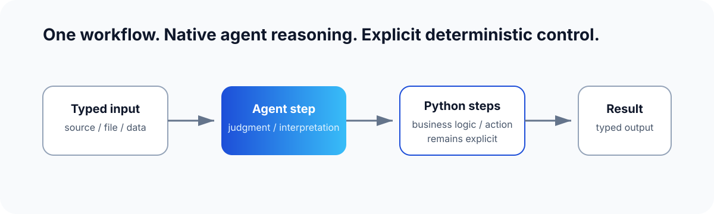

# Agentic ETL & Workflows

Build developer-defined workflows that combine native agent reasoning with
deterministic Python for business logic and critical actions.

Avalanche sits between isolated LLM calls and handing an entire task to a hosted
agent. You define the workflow, dependencies, rules, and consequential actions.
Use native agent steps where judgment, interpretation, or flexible execution is
useful.



## A workflow keeps the important parts explicit

```python
import avalanche as ava


@ava.source
def load_request() -> str:
    return "Classify this customer request."


@ava.agent_step(ava.Signature("request: str -> category: str"))
async def classify_request(request: str, *, agent: ava.Agent) -> str:
    return (await agent(request=request)).category


@ava.step
def choose_route(category: str) -> str:
    return {"billing": "finance", "support": "service"}.get(category, "triage")


@ava.dest
def publish_route(route: str) -> str:
    return route


@ava.workflow
def route_request():
    return load_request() >> classify_request() >> choose_route() >> publish_route()
```

The agent step supplies the judgment. The surrounding Python keeps the workflow
shape, business rule, and action explicit and inspectable.

## Install Avalanche

Choose the path that matches where you are starting.

### Create a starter workspace (recommended)

In a new, empty directory:

```bash
uvx avalanche-ai init
```

This creates a ready-to-run project with an example workflow, the Avalanche
authoring skill, and provider setup. [Create the workspace](./start-here/starter-workspace),
then [run its workflow](./start-here/run-starter).

### Add Avalanche to an existing project

```bash
uv add avalanche-ai
```

Use this path when Avalanche belongs alongside application code. [Add it to an
existing project](./start-here/existing-project) for optional skill setup and a
narrow local run target.

> **Local release candidate.** Avalanche is intended for local development and
> experimentation. The current release does not provide a production deployment
> control plane, authentication, multi-tenancy, or durable recovery.

## Continue

- **Have a starter workspace:** [run the included workflow](./start-here/run-starter).
- **Want to author with an agent:** [build a workflow with the skill](./start-here/build-with-skill).
- **Need the API:** [browse the Python and CLI reference](./reference/python-api).
