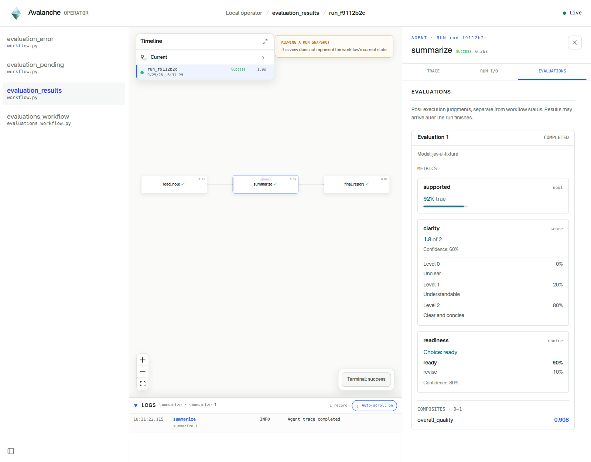
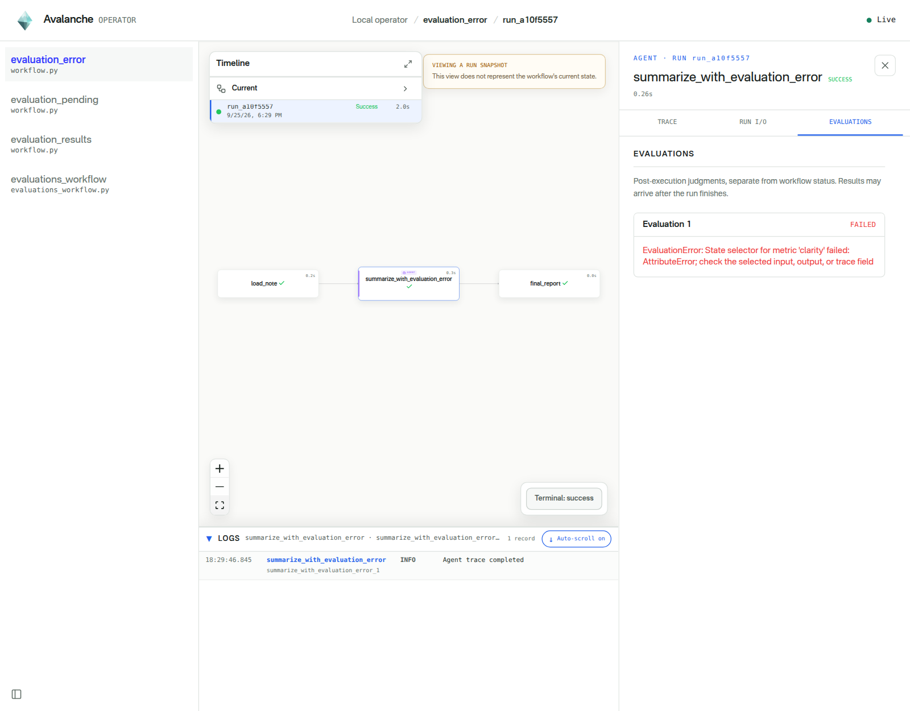

# Agent steps

For the author-facing decorator parameters, call signature, configuration, and
errors, see the [agent API reference](api/agents.md).
See the [package API index](api/README.md) for other interfaces.

`@ava.agent_step` is an ordinary Avalanche workflow step with an injected,
callable agent. The body maps workflow values into model inputs, calls the
agent, validates or composes the raw prediction, and explicitly persists its
own result.

Agent execution is implemented on top of
[PredictRLM](https://github.com/Trampoline-AI/predict-rlm). Avalanche lazily
constructs a PredictRLM predictor when the injected agent is first called, while
the surrounding function remains an ordinary Avalanche step.


The public surface has two equivalent entry points:

```python
ava.Signature is ava.agent.Signature
ava.agent_step is ava.agent.step
```

Use root aliases for typed signature classes and `ava.agent` for the agent
integration namespace, skills, files, and inline signature factory.

## Quick start

Configure the credentials required by your PredictRLM model, then declare the
model contract, the agent-backed step, and the workflow:

```python
import avalanche as ava
from pydantic import BaseModel


class Review(BaseModel):
    summary: str
    approved: bool


class ReviewSignature(ava.Signature):
    """Review a document for publication."""

    document: str = ava.InputField(desc="Document text to review.")
    review: Review = ava.OutputField(desc="Publication decision and summary.")


@ava.agent_step(ReviewSignature, lm="openai/gpt-5.5")
async def review_document(document: str, *, agent: ava.Agent) -> Review:
    prediction = await agent(document=document)
    return prediction.review


@ava.workflow
def review_flow():
    return review_document("Avalanche composes durable data and agent steps.")


result = review_flow().run(executor=ava.LocalExecutor()).result()
print(result.summary, result.approved)
```

The `agent` argument is injected by Avalanche; callers pass only ordinary
workflow values. The step body is asynchronous because the model call is
awaitable. `Workflow.run()` returns an awaitable run handle; `.result()` is the
explicit synchronous wait above.

The browser's **Step interface** panel describes `review_document`'s Python
parameters and return annotation, excluding the injected `agent`. It is separate
from **Inputs & outputs**, which describes `ReviewSignature` and each agent call.
The two contracts can differ when the step batches calls or transforms a prediction.
Current definitions show the step interface below the agent configuration;
historical **Run I/O** shows the interface captured for that run. See
[step interface inspection](dag-api.md#inspect-step-interfaces) for schema details.

Use `ava.input` when the value arrives at run time instead of being fixed in the
workflow declaration:

```python
class ReviewRequest(ava.BaseInput):
    document: str


@ava.workflow(input=ReviewRequest)
def review_flow():
    return review_document(ava.input.document)


result = review_flow().run(
    executor=ava.LocalExecutor(),
    input=ReviewRequest(document="Text supplied by this workflow run."),
).result()
```

## Typed signature class

`ava.Signature` intentionally mirrors
[DSPy's Signature API](https://dspy.ai/api/signatures/Signature/). It subclasses
`dspy.Signature`; `ava.InputField` and `ava.OutputField` are direct re-exports of
the DSPy field helpers; and the inline string form delegates to DSPy's signature
factory. Type annotations carry field types, while the field helpers mark input
and output direction and optionally describe each field. Native DSPy signature
classes are also accepted directly.

```python
import avalanche as ava
from predict_rlm import File
from pydantic import BaseModel


class RfpAudit(BaseModel):
    requirements: list[str]
    risks: list[str]


class AuditRfpSig(ava.Signature):
    """Read the RFP and identify requirements and submission risks."""

    documents: list[File] = ava.InputField(
        desc="All RFP documents supplied by the issuer."
    )
    audit: RfpAudit = ava.OutputField(
        desc="Structured RFP requirements and risks."
    )


# `ns.audit_results` is this belt's model-declared audit table.
@ava.agent_step(
    AuditRfpSig,
    skills=[ava.agent.skills.pdf],
)
async def audit_rfp(
    documents: list[File],
    *,
    agent: ava.Agent,
    # The table binding remains explicit at the step declaration boundary.
    dest: ava.Table = ns.audit_results,
) -> ava.AppendResult:
    prediction = await agent(documents=documents)
    return dest.append(prediction.audit)
```

The injected `agent` parameter is required and keyword-only. It is never passed
at a workflow callsite:

```python
@ava.workflow(input=PreparedInputs)
def proposal_flow():
    return audit_rfp(documents=ava.input.rfp_documents)
```

## Inline string signature

For a small local contract, build the native DSPy signature inline:

```python
quick_answer_sig = ava.agent.Signature(
    "question: str, context: str -> answer: str, citations: list[str]",
    "Answer the question from context and cite the supporting passages.",
)


@ava.agent.step(
    quick_answer_sig,
    skills=[ava.agent.skills.pdf],
    tools=[search_internal_knowledge_base],
)
async def answer_question(
    question: str,
    context: str,
    *,
    agent: ava.Agent,
) -> str:
    prediction = await agent(question=question, context=context)
    return prediction.answer
```

Use a typed class for substantial, shared, or independently tested prompt
contracts. Use the inline form for compact local contracts.

## Raw predictions and multiple outputs

`await agent(...)` always returns the raw DSPy prediction. Avalanche never
selects an output, derives a table, or appends automatically.

`prediction.trace` contains the agent's execution trace. Its type,
`ava.agent.AgentTrace`, is the same as PredictRLM's `RunTrace`.

```python
class DraftArtifactsSig(ava.Signature):
    """Render proposal artifacts from an approved plan."""

    plan: ProposalPlan = ava.InputField()
    proposal: str = ava.OutputField()
    compliance_matrix: str = ava.OutputField()


@ava.agent_step(DraftArtifactsSig)
async def render_artifacts(
    plan: ProposalPlan,
    *,
    agent: ava.Agent,
    dest: ava.Table = ns.draft_artifacts,
) -> ava.AppendResult:
    prediction = await agent(plan=plan)
    return dest.append(
        DraftArtifacts(
            proposal=prediction.proposal,
            compliance_matrix=prediction.compliance_matrix,
        )
    )
```

Keep local extraction, file selection, validation, logging, and output
composition in the body beside the call. Create a separate plain `@ava.step`
only when work becomes a reusable durable artifact, deserves its own
retry/rerun boundary, fans out independently, or has substantial I/O.

## Skills and tools

Skills and tools are execution capabilities of a specific agent step, not
signature metadata. A reusable signature therefore remains only the model input
and output contract:

```python
quick_answer_sig = ava.agent.Signature(
    "question: str -> answer: str",
    "Answer accurately.",
)
```

Configure every capability where the signature is used:

```python
@ava.agent_step(
    quick_answer_sig,
    skills=[ava.agent.skills.pdf, ava.agent.skills.docx],
    tools=[search_contract_repository],
)
async def answer_contract_question(..., *, agent: ava.Agent):
    ...
```

Tools are ordinary callables with unique stable `__name__` values.
`ava.agent.skills.pdf`, `.docx`, and `.spreadsheet` are lazy,
identity-preserving PredictRLM re-exports. `ava.agent.Skill` constructs custom
PredictRLM skills.

## Runtime configuration

Workflow-scoped defaults configure shared PredictRLM execution policy:

Agent steps are quiet by default (`verbose=False`); set `verbose=True` on an
individual `@ava.agent_step` or in `agent_defaults` when live PredictRLM trace
output is needed.

```python
@ava.workflow(
    input=PreparedInputs,
    agent_defaults={
        "lm": "openai/gpt-5.5",
        "sub_lm": "gemini/gemini-3.5-flash",
        "max_iterations": 30,
        "verbose": False,
    },
)
def proposal_flow():
    return audit_rfp(documents=ava.input.rfp_documents)


@ava.agent_step(AuditRfpSig, max_iterations=60)
async def expensive_audit(..., *, agent: ava.Agent):
    ...
```

Resolution order:

```text
agent-step runtime kwargs > workflow agent_defaults > Avalanche agent defaults >
PredictRLM defaults
```

Workflow defaults cannot configure `signature`, `skills`, or `tools`; those are
agent-definition capabilities.

## Native evaluations

Attach observation-only quality judgments with `evaluations=`. Keep each
metric's **evidence selector** separate from its **question**: `state` is a
synchronous Python callable; `question` is one existing TypeSafe Noul, Score,
or Choice question, using the same format as
[`classifier_step(questions=...)`](classifier-steps.md).

Using `ReviewSignature` and `Review` from the quick start:

```python
review_evaluations = ava.Evaluations(
    metrics={
        "clarity": ava.Metric(
            state=lambda ctx: ctx.output.summary,
            question={
                "type": "score",
                "instructions": "How understandable is this summary?",
                "criteria": ["Confusing", "Mostly clear", "Clear throughout"],
            },
        ),
        "concise": ava.Metric(
            state=lambda ctx: ctx.output.summary,
            question={
                "type": "noul",
                "instructions": "Is the summary free of unnecessary repetition?",
            },
        ),
        "grounding": ava.Metric(
            state=lambda ctx: {
                "document": ctx.inputs["document"],
                "summary": ctx.output.summary,
            },
            question={
                "type": "choice",
                "instructions": "How does the summary relate to the document?",
                "criteria": {
                    "supported": "All summary claims are supported by the document.",
                    "unsupported": "At least one claim is unsupported or contradicted.",
                },
            },
        ),
        "checked_evidence": ava.Metric(
            state=lambda ctx: ctx.trace,
            question={
                "type": "noul",
                "instructions": (
                    "Do the recorded agent invocations show that the agent checked "
                    "the supplied evidence before producing its final answer?"
                ),
            },
        ),
    },
    composites={
        "readability": lambda results: (
            0.7 * (results.scores["clarity"].score / 2)
            + 0.3 * results.nouls["concise"].noul
        ),
    },
)


@ava.agent_step(ReviewSignature, evaluations=review_evaluations)
async def review_document(document: str, *, agent: ava.Agent) -> Review:
    prediction = await agent(document=document)
    return prediction.review
```

### Select existing execution evidence

Selectors receive `ava.EvalContext(inputs, output, trace)`:

- `ctx.inputs` is the bound mapping of step arguments, including defaults but
  excluding injected services such as `agent`.
- `ctx.output` is the **actual final Python return**, not the last raw agent
  prediction. If the step returns a Pydantic model, select its fields directly
  or use `.model_dump(mode="json")` for the whole model.
- `ctx.trace` is the JSON-compatible list of terminal trace events from **all
  agent calls in the step**, including invocation IDs, exported trace bodies,
  and unavailable-trace errors. It is not just the final call's trace.

Metric rows label statically visible selector sources as **Trace**, **Output**, or
**Input**, followed by the relative field path. For example, `ctx.output.summary`
appears as **Output** `summary`; a selector using source text and output shows both
sources. Python inspects selector syntax without executing it. Opaque or
uninspectable callables show **Custom** and their identity rather than inferred
fields. These labels describe selection, not the raw evidence sent to TypeSafe.
Run views use captured declarations; older declarations without this metadata
do not invent source labels.

Reuse the step's existing inputs and return types. There is no mandatory second
context schema, `input_type`, or `output_type`. Optional selector annotations
can use `ava.EvalContext`; they do not change runtime validation.

Only selected text, JSON objects, or JSON arrays are sent to Jev. Nested numbers
must be finite. Convert Python-only values explicitly; arbitrary objects are
not stringified. Evaluation does not open files, extract document content, or
evaluate images/media: a path is only text, not file evidence. Select already
available text/JSON when evaluating a file-producing agent.

The full `ctx.trace` may repeat agent steps in both `steps` and `evidence.events`,
and may include an output again as `untruncated_output`. Large traces can exceed
[Jev's context budget](https://docs.typesafe.ai/models). Select the source facts
and observable actions needed for your question instead of sending both copies
or silently truncating evidence.

### Answers, composites, and batching

Composites are synchronous Python functions receiving one
`ava.ClassificationResult` containing all metric answers under their names:

| Accessor | Meaning |
| --- | --- |
| `results.answers["clarity"]` | The original typed answer |
| `results.nouls["concise"].noul` | Probability of yes, in `[0, 1]`; not a Boolean or separate confidence |
| `results.scores["clarity"].score` | Fractional, probability-weighted rubric position |
| `results.scores["clarity"].legend` | The original ordered rubric |
| `results.choices["grounding"].choice` | Selected option |
| `.probabilities`, `.confidence` on Choice/Score answers | Distribution and confidence, preserved without normalization |

An `N`-level Score ranges from `0` to `N - 1`. Normalize explicitly in a
composite with `score / (N - 1)`; the three-level clarity rubric above uses
`/ 2`. Every composite must return a finite number in `[0, 1]`. There are no
`.normalized` or `.probability` aliases, composite dependencies, or extra model
calls for composites. Raw answers remain unchanged.

Avalanche groups equal selected JSON/text state with compatible evaluator
settings. Above, clarity and concision share one request; grounding and trace
evidence remain separate. Equality is based on selected content, not lambda
identity. Do not merge different states into one large object to force batching:
that exposes extra evidence to every question. There is no question-count
heuristic; ordinary service request limits still apply.

### Configure and run

Set `TYPESAFE_API_KEY` in the operator environment, in addition to credentials
for the PredictRLM agent's model provider. Evaluation configuration follows
classifier conventions:

```text
ava.Evaluations(model=..., timeout=...)
    > @ava.workflow(classifier_defaults={...})
    > model="jev-latest", timeout=10.0
```

`timeout` is the positive, finite SDK request timeout in seconds, not a workflow
deadline. `model=None` and `timeout=None` inherit defaults. Agent `lm`/`sub_lm`
and `agent_defaults` do not configure Jev. Declarations and discovery make no
model calls and need no credentials; malformed questions fail at declaration.

A TypeSafe HTTP 401 means authentication was rejected, not that the output failed
a quality check. Verify `TYPESAFE_API_KEY`; an exported value takes precedence
over `.env`. After changing credentials, restart the operator and run again.
Do not paste keys into logs or issue reports.

An HTTP 400 with `max_tokens_exceeded` means the selected state and questions
exceeded TypeSafe's model context. Avalanche shows that machine-readable error
code without logging the request body, which can contain private source records,
agent code, and outputs. Reduce the evidence selected for that metric and rerun.

Run the repository's real-agent example from the repository root:

```bash
# Set OPENAI_API_KEY and TYPESAFE_API_KEY in the environment (or project .env).
uv run ava dev examples/evaluations_workflow.py
```

Before running, the agent node shows an **Evaluations** badge with its metric
count, including when zoomed out. Select the node in **Current**, then **Evals**,
to inspect its named metrics, question types, expandable criteria, composite names,
and effective Jev model and timeout. **Agent definition** contains instructions,
agent inputs/outputs, models, and resources; **Step definition** contains only the
step interface card. These tabs describe configuration, not completed judgments.
Historical run graphs retain their captured declarations after source edits.

Select `evaluations_workflow` and click **Run** without supplying JSON or files.
The source generates a synthetic checkout incident: error-rate windows, deployment
events, support tickets, and on-call notes. A real agent prepares an evidence-linked
handoff, and a deterministic final step renders it as Markdown. No customer message
is sent and no external system is changed.

After running, inspect `prepare_incident_handoff` → **Evaluations** for grounding, actionability,
publication readiness, clarity, and trace-inspection judgments. The `handoff_quality`
composite combines Noul probability, explicitly normalized Scores, and a Choice
probability. Three questions share the same source-and-handoff state and can batch
together; clarity selects two text fields, while trace inspection selects source
records and observed per-iteration code and output once rather than duplicating
the complete terminal trace.

Inspect `render_handoff` for the finished brief. The scenario deliberately includes
an unverified duplicate-charge report and too little recovery history to declare
resolution, so a useful answer must distinguish improvement from proven recovery.
The input data is synthetic; OpenAI agent calls and TypeSafe judgments are real.
Evaluation authentication errors remain visible separately from the completed brief.

### Execution, errors, and retention

Automatic evaluations run **only in operator-managed execution**, after a
successful agent-step return. The operator owns the background worker, so
evaluation completion is not awaited by downstream steps or workflow result
delivery. Failed steps do not schedule evaluations. Evaluation errors never
fail, retry, route, or otherwise gate the workflow.

Each execution has a separate record with `pending`, `completed`, or `failed`
status. A successful workflow can still have pending or failed evaluations.
Selectors, invalid selected state, Jev requests, and invalid composites report
evaluation errors, not fabricated scores. Late results do not reopen or change
the workflow's terminal status. Reruns retain separate records rather than
overwriting earlier judgments.

Records survive normal coordinator completion, but are **local, in-memory
operator state**. They do not survive operator restart; this is not durable
recovery storage. Embedded Python `.run()` accepts declarations but reports
**not evaluated** and starts no automatic evaluation worker.

Clients can query `ListEvaluations` with `runId` and optional `nodeId`, or use
`GET /api/v1/runs/{run_id}/evaluations?node_id=...` on the development REST API.
The RPC returns separate records; completed records carry `resultJson` with
`classification` (raw TypeSafe answers) and `composites`. Evaluation records
are not structural workflow status updates.

Python validates classification answers and composites before publishing results.
The browser decodes and displays those values; it does not recalculate scores or
repeat the result validation rules.

### Browser examples



*Actual operator browser UI using controlled SDK fixture responses to illustrate
metric/composite display; these are not live Jev judgments.*



*Actual operator browser UI: a deliberately failing selector leaves the workflow
successful. Captured with controlled fixture data, not live Jev verification.*
