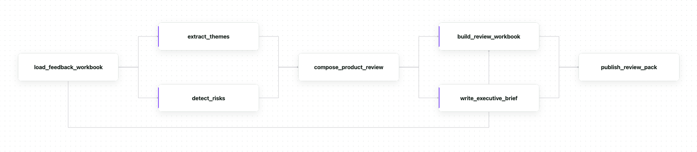

# Customer feedback review

This example is closer to what a real production Avalanche workflow can look
like. It turns a raw customer-feedback workbook into a published product-review
pack. It loads a typed Excel workbook, runs theme and risk analysis in parallel,
validates and synthesizes both reports deterministically, renders an Excel
workbook and a Word executive brief in parallel, and publishes the resulting
review pack to an output directory.

We define the steps below. The source loads the bundled workbook as a typed
`File`:

```python
@ava.source
def load_feedback_workbook() -> File:
    return File(path=str(FEEDBACK_WORKBOOK_PATH))
```

We define two agent steps that analyze the same workbook. Each receives the
spreadsheet skill plus a shared `evidence-coding` skill that keeps deterministic
counting in Python and uses the model only for semantic judgments:

```python
@ava.agent_step(
    ExtractThemes,
    lm=MODEL,
    sub_lm=SUB_MODEL,
    skills=[ava.agent.skills.spreadsheet, evidence_coding_skill],
)
async def extract_themes(workbook: File, *, agent: ava.Agent) -> ThemeReport:
    prediction = await agent(workbook=workbook)
    return ThemeReport.model_validate(prediction.report)


@ava.agent_step(
    DetectRisks,
    lm=MODEL,
    sub_lm=SUB_MODEL,
    skills=[ava.agent.skills.spreadsheet, evidence_coding_skill],
)
async def detect_risks(workbook: File, *, agent: ava.Agent) -> RiskReport:
    prediction = await agent(workbook=workbook)
    return RiskReport.model_validate(prediction.report)
```

We reconcile both reports in a deterministic step before rendering anything. It
rejects mismatched row counts, segment totals that do not sum to the feedback
count, duplicated accounts, and ARR totals that disagree with their affected
accounts:

```python
@ava.step
def compose_product_review(
    themes: ThemeReport,
    risks: RiskReport,
) -> ProductReview:
    if themes.feedback_rows_analyzed != risks.feedback_rows_analyzed:
        raise ValueError(
            "theme and risk reports analyzed different feedback row counts: "
            f"{themes.feedback_rows_analyzed} != {risks.feedback_rows_analyzed}"
        )
    ...
    return ProductReview(
        feedback_rows_analyzed=themes.feedback_rows_analyzed,
        themes=themes.themes,
        risks=risks.risks,
    )
```

We render the approved review with two further agent steps. Each writes to its
own `output_dir`:

```python
@ava.agent_step(
    BuildReviewWorkbook,
    lm=MODEL,
    sub_lm=SUB_MODEL,
    skills=[ava.agent.skills.spreadsheet],
    output_dir=WORKBOOK_OUTPUT_DIR,
)
async def build_review_workbook(
    source_workbook: File,
    review: ProductReview,
    *,
    agent: ava.Agent,
) -> File:
    prediction = await agent(source_workbook=source_workbook, review=review)
    return File.model_validate(prediction.workbook)


@ava.agent_step(
    WriteExecutiveBrief,
    lm=MODEL,
    sub_lm=SUB_MODEL,
    skills=[ava.agent.skills.docx],
    output_dir=BRIEF_OUTPUT_DIR,
)
async def write_executive_brief(
    review: ProductReview,
    *,
    agent: ava.Agent,
) -> File:
    prediction = await agent(review=review)
    return File.model_validate(prediction.brief)
```

We use a typed destination to validate the rendered files and publish them as a
review pack:

```python
@ava.dest
def publish_review_pack(workbook: File, brief: File) -> PublishedReviewPack:
    return publish_review_pack_files(
        workbook,
        brief,
        destination=PUBLISHED_OUTPUT_DIR,
    )
```

We then chain the steps in a workflow:

```python
@ava.workflow
def feedback_review():
    return (
        (workbook := load_feedback_workbook())
        >> ((themes := extract_themes(workbook)) & (risks := detect_risks(workbook)))
        >> (review := compose_product_review(themes, risks))
        >> (build_review_workbook(workbook, review) & write_executive_brief(review))
        >> publish_review_pack()
    )
```

We run the workflow with the dev command:

```bash
uv run ava dev --flows customer_feedback_review/flow.py
```

The resulting graph has 5 execution stages, with 7 total nodes, 3 ava.step and 4 ava.agent_step:

<p align="center">
  
</p>

Both analysis agents receive the same workbook `File`. Avalanche runs them
concurrently, then binds their `ThemeReport` and `RiskReport` outputs into the
deterministic `compose_product_review` step, which fails loudly on any
inconsistency before rendering. The approved `ProductReview` fans out again to
render an Excel workbook and a Word brief in parallel, and `publish_review_pack`
is a typed destination that validates both files and copies them into the
published output directory.

Generated artifacts land under `.avalanche/outputs/feedback_review/<pid>/` by
default. `AVALANCHE_EXAMPLE_ROOT` redirects that artifact root when configured.

We can change the `lm`/`sub_lm` values or their environment-variable overrides
to use another model supported by PredictRLM/DSPy. See
[Agent steps](../../docs/agent-steps.md) for skills, tools, multi-output
signatures, runtime defaults, and larger typed contracts.
